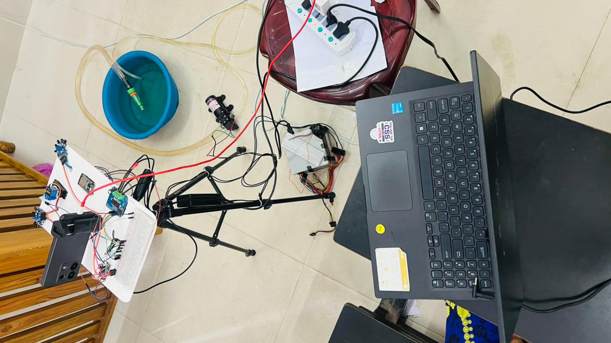
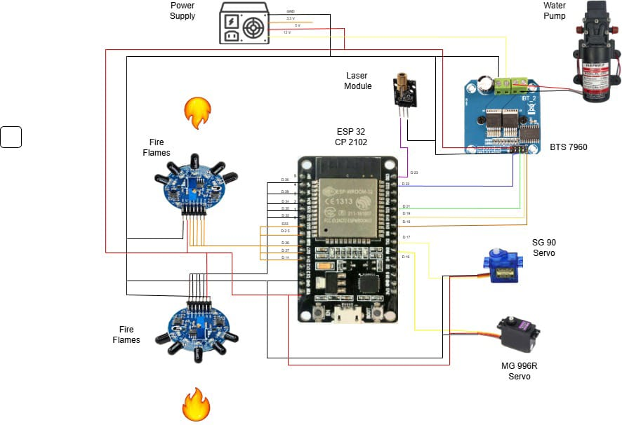
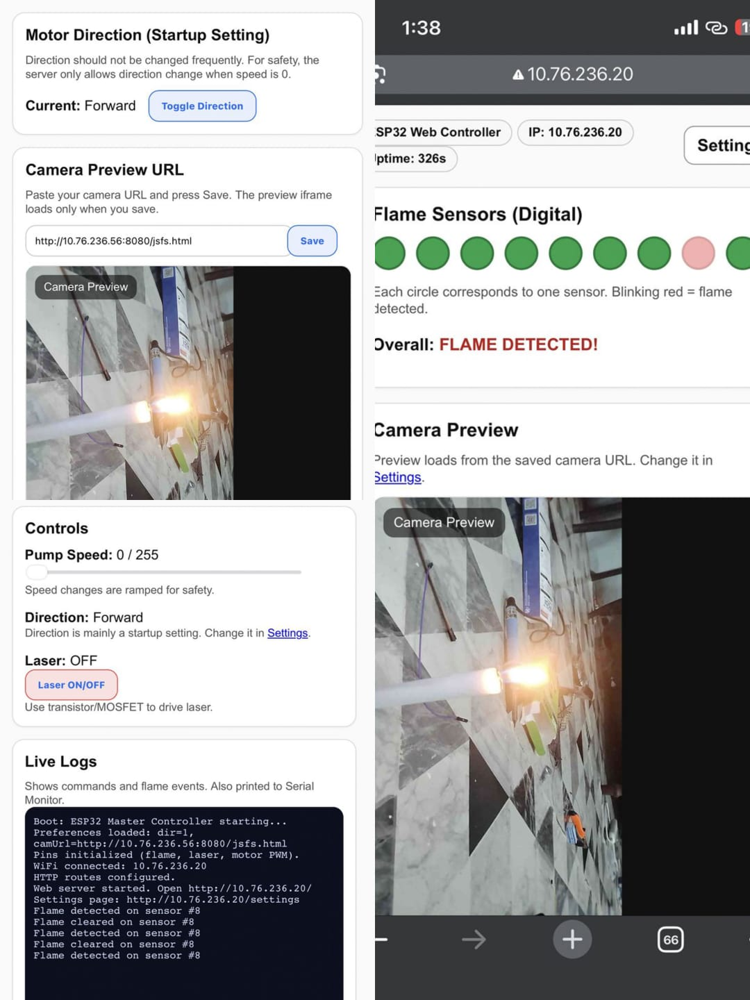

# FireBot 🚒🔥  
ESP32-based **Fire Detection + Pump Control + Laser + Camera Preview + Pan/Tilt (Dual Servo)** system with an onboard **Web UI**.

---

## Table of Contents  
1. [Project Summary](#project-summary)  
2. [Goals](#goals)  
3. [What This Repository Contains](#what-this-repository-contains)  
4. [System Overview](#system-overview)  
5. [Hardware Overview](#hardware-overview)  
6. [Power Architecture](#power-architecture)  
7. [Pin Map](#pin-map)  
8. [Motor / Pump Subsystem](#motor--pump-subsystem)  
9. [Flame Sensor Subsystem](#flame-sensor-subsystem)  
10. [Servo Pan/Tilt Subsystem](#servo-pantilt-subsystem)  
11. [Laser Subsystem](#laser-subsystem)  
12. [Camera Preview Subsystem](#camera-preview-subsystem)  
13. [Software Overview](#software-overview)  
14. [Web UI Overview](#web-ui-overview)  
15. [HTTP Routes / API](#http-routes--api)  
16. [Safety Features](#safety-features)  
17. [Build & Upload Guide (Arduino IDE)](#build--upload-guide-arduino-ide)  
18. [Initial Calibration Checklist](#initial-calibration-checklist)  
19. [Troubleshooting](#troubleshooting)  
20. [Roadmap / Future Improvements](#roadmap--future-improvements)  
21. [License](#license)  
22. [Credits](#credits)  

---

## Project Summary  
**FireBot** is a Wi-Fi enabled ESP32 controller for a compact fire-response / monitoring build.  
It combines:  
- **10× digital flame sensors** (dashboard indicators + logs)  
- **High current brushed DC motor pump** driven by **BTS7960** (speed slider + ON/OFF)  
- **Two servos** for aiming / motion:  
  - **SG90 micro servo** (X axis)  
  - **MG996R high-torque servo** (Y axis)  
- **Laser toggle** output (driven through a MOSFET/transistor)  
- **Camera preview** embedded as an iframe with rotate/fullscreen/resize  
- A responsive **Web UI** served directly from ESP32  

This repository is designed to be:  
- **Easy to reproduce** (clear wiring + setup steps)  
- **Safe by default** (motor ramping + direction lockout)  
- **Maintainable** (documented architecture + routes)  
- **Demo-friendly** (UI, logs, and camera preview all in one place)  

---

## Goals  
The FireBot project aims to:  
1. Provide **real-time flame detection** visibility from multiple sensor points.  
2. Provide a **reliable pump controller** with safe speed changes and manual ON/OFF.  
3. Allow **direction configuration** (forward/reverse) but discourage frequent toggling.  
4. Provide **servo aiming control** using a web joystick and exact angle inputs.  
5. Allow **remote control** from any phone/laptop connected to the same Wi-Fi network.  
6. Offer a **camera preview panel** inside the same web dashboard.  
7. Keep the system understandable and modifiable (clean code + full documentation).  

---

## What This Repository Contains  
Typical layout:  
- `README.md` → this documentation (main index page)  
- `FireBot.ino` (or similar) → complete firmware source  
- `docs/images/` → project images (hardware + diagram + UI screenshot)  

Images included:  
- `docs/images/diagram.jpeg` → wiring / system diagram  
- `docs/images/project_pic1.jpeg` → hardware photo (project view)  
- `docs/images/ss_webview_v1.jpeg` → web UI screenshot  

---

## System Overview  

### High-level data/control flow  
1. Flame sensors send **digital signals** to ESP32 GPIO pins.  
2. ESP32 firmware:  
   - reads sensors  
   - updates internal state  
   - appends log messages  
3. ESP32 hosts a Web UI:  
   - polls `/status` for live state  
   - polls `/logs` for incremental log messages  
4. User actions from Web UI call HTTP endpoints:  
   - pump speed / on / off  
   - laser toggle  
   - servo moves (joystick hold) and set angles  
   - settings (camera URL, direction)  

---

## Hardware Overview  

### 1) Main controller board  
- **ESP32 DevKit V1 (ESP-WROOM-32)**  
- Wi-Fi enabled  
- Enough GPIO pins for sensors + motor driver + servos + laser  

### 2) Flame sensors (10x)  
- Digital output modules  
- In your build: **signal = 3.3V HIGH when flame detected** (active HIGH)  
- Powered from external supply (with **common ground**)  

### 3) Pump motor + driver  
- Pump: based on **775 brushed DC motor** (high current)  
- Driver: **BTS7960 43A module**  
- PSU: PC power supply **12V 38A** (as stated)  

### 4) Servos  
- X axis: **SG90 (9g micro servo)**  
- Y axis: **MG996R (high torque)**  

### 5) Laser  
- Laser module controlled via GPIO signal  
- Must be driven using a MOSFET/transistor  

### 6) Camera preview  
- Any camera/web address (IP cam page / ESP32-CAM stream page / NVR preview URL)  
- The firmware stores this URL and embeds it in the dashboard iframe  

---

## Project Images  

### Hardware photo  

  

### Wiring / diagram  

  

### Web UI screenshot  

  

---

## Power Architecture  

### Why power architecture matters  
This project includes:  
- a high current DC motor (pump)  
- a high torque servo (MG996R)  
- multiple sensors  

If power is unstable, you may see:  
- ESP32 resets  
- servo jitter  
- false sensor triggers  
- motor driver glitches  

### Recommended power plan  
1. **Pump / motor power**  
   - Use your **12V PC PSU** for the BTS7960 + motor.  
2. **Servo power**  
   - Use a separate regulated **5V supply** (recommended ≥ 3A if MG996R can stall).  
3. **Sensor power**  
   - Can be from 3.3V/5V depending on module.  
   - If from separate supply, ensure **common ground** with ESP32.  
4. **ESP32 power**  
   - ESP32 via USB is OK for logic and Wi-Fi.  
   - Ensure USB ground is common with all other subsystems.  

### Common Ground Rule (critical)  
Even with separate supplies:  
- ESP32 GND  
- Sensor GND  
- Servo GND  
- BTS7960 driver GND  
must be connected together.  

Without common ground you can get:  
- floating inputs  
- random “flame detected” indicators  
- servo not responding  
- unstable PWM control  

---

## Pin Map  

### Flame sensors (10 digital inputs)  
| Sensor | GPIO | Notes |
|---:|---:|---|
| 1 | 34 | input-only, no internal pull |
| 2 | 35 | input-only, no internal pull |
| 3 | 36 | input-only, no internal pull |
| 4 | 39 | input-only, no internal pull |
| 5 | 32 | normal GPIO |
| 6 | 33 | normal GPIO |
| 7 | 25 | normal GPIO |
| 8 | 26 | normal GPIO |
| 9 | 27 | normal GPIO |
| 10 | 14 | normal GPIO |

⚠️ GPIO 34/35/36/39 do not have internal pullup/pulldown resistors.  
If your sensor output floats when idle, add **10k pulldown** resistors.

### BTS7960 motor driver (pump)  
| Driver Pin | GPIO |
|---|---:|
| RPWM | 18 |
| LPWM | 19 |
| REN | 21 |
| LEN | 22 |

### Laser  
| Device | GPIO |
|---|---:|
| Laser signal | 23 |

### Servos  
| Servo | Axis | GPIO |
|---|---|---:|
| SG90 | X | 16 |
| MG996R | Y | 17 |

---

## Motor / Pump Subsystem  

### What BTS7960 does  
The BTS7960 module is a high current H-bridge driver.  
It can drive brushed DC motors bidirectionally using:  
- two PWM inputs (LPWM, RPWM)  
- two enable pins (LEN, REN)  

### How speed is controlled  
- The firmware uses ESP32 **LEDC PWM** at **20 kHz**.  
- Speed is represented as **0..255**.  
- A signed speed is used internally:  
  - positive = forward  
  - negative = reverse  

### Why ramping/fade is used  
Large motors can draw huge current spikes on sudden changes.  
Ramping helps to:  
- reduce PSU spikes  
- reduce mechanical shock  
- reduce heat in the driver  
- improve reliability  

### Direction change lockout  
When changing direction, firmware:  
1. ramps speed down to 0  
2. waits briefly (lockout delay)  
3. ramps up in the new direction  

### Pump ON/OFF buttons  
- **Pump OFF** → immediate stop (PWM forced to 0)  
- **Pump ON** → resumes last saved speed  

---

## Flame Sensor Subsystem  

### Digital flame sensors  
You use the **digital output** from each sensor.  

### Active HIGH behavior  
Your sensors output **3.3V HIGH** when flame is detected.  
Firmware setting: `FLAME_ACTIVE_LOW = false`

### Avoiding false triggers  
- ensure common ground  
- add pulldown resistors where needed  
- shorten wiring  
- decouple power rails  

---

## Servo Pan/Tilt Subsystem  

### Servos used  
- SG90: micro servo for X axis  
- MG996R: high torque servo for Y axis  

### Servo PWM  
- 50 Hz PWM using LEDC  
- pulse width mapped from degrees  

### Web joystick UI  
- Left/Right = X  
- Up/Down = Y  
- Press-and-hold repeats commands  

### Exact angle inputs  
- X angle set  
- Y angle set  

### Zero positioning  
- X ZERO and Y ZERO return to neutral  
- Optional ZERO BOTH available  

---

## Laser Subsystem  
GPIO output toggles the laser driver.

---

## Camera Preview Subsystem  
Iframe embeds user-defined camera URL.  
Rotation and resizing are handled in UI.

---

## Software Overview  
- Wi-Fi connect  
- WebServer routes  
- periodic sensor updates  
- motor PWM ramp control  
- servo PWM mapping + smooth motion  
- logs + state JSON APIs  
- settings stored in NVS (Preferences)

---

## Web UI Overview  
Main page `/` provides:  
- flame grid  
- camera preview  
- pump speed + pump ON/OFF  
- laser toggle  
- joystick servo control + exact angle set  
- live logs  

Settings page `/settings` provides:  
- direction toggle (safe)  
- camera URL edit + preview  

---

## HTTP Routes / API  
See the repository firmware comments for full list.  
Key endpoints: `/status`, `/logs`, `/setSpeed`, `/pumpOn`, `/pumpOff`, `/toggleLaser`, servo endpoints, and settings endpoints.

---

## Build & Upload Guide (Arduino IDE)  
1. Install Arduino IDE 2.x  
2. Install ESP32 boards package in Boards Manager  
3. Open the `.ino` file  
4. Set Wi-Fi SSID/password in code  
5. Select board: ESP32 Dev Module  
6. Upload  
7. Open Serial Monitor (115200)  
8. Visit `http://<ESP32_IP>/`  

---

## Troubleshooting  
- False flame: check ground + pulldown resistors on GPIO34/35/36/39  
- Servo resets: use separate 5V supply for MG996R  
- Camera blank: check URL + iframe blocking  
- Direction toggle rejected: set speed to 0 first  

---

## Roadmap / Future Improvements  
- OTA updates  
- login/auth  
- optional automatic pump response  
- servo speed slider  
- MQTT integration  

---

## License  
Add a `LICENSE` file (MIT recommended).

---

## Credits  
FireBot project integration and testing by the project author.

---

## Quick Start Checklist  
- Wire everything + common ground  
- Upload firmware  
- Open web UI  
- Configure camera URL in settings  
- Test sensors, pump, servos, and laser  

(End of main README)